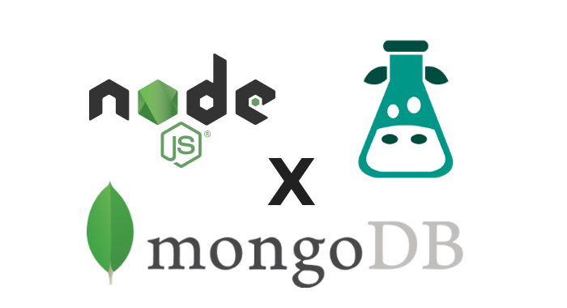

[](https://www.npmjs.com/package/i18next-node-mongodb-backend-next)
[](https://github.com/lamualfa/i18next-node-mongodb-backend-next/blob/master/LICENSE)
[](https://travis-ci.com/lamualfa/i18next-node-mongodb-backend-next)
[](https://github.com/prettier/prettier)

## Are you a Deno user? If `true`, we provide the same library for Deno. See: [Mongo Backend for Deno](https://github.com/lamualfa/dn-i18next-mongo-backend) 🦖

#### Inspired from [i18next-node-mongodb-backend](https://github.com/gian788/i18next-node-mongodb-backend) with support for `mongodb@3.5.x` and some bug fixes and more improvements

# Integrate [i18next](https://github.com/i18next/i18next) with [MongoDB](https://www.mongodb.com/)

<div align="center">

</div>

# Introduction

This is a [i18next](https://github.com/i18next/i18next) backend to be used Node JS. It will load resources from a [MongoDB](https://www.mongodb.org) database with official node mongodb [driver](https://mongodb.github.io/node-mongodb-native/3.5/).

> Prevously is **i18next-node-mongo-backend**. Because i lost my NPM account, the package was renamed to **i18next-node-mongodb-backend-next**.

# Getting started

```bash
yarn add mongodb i18next-node-mongodb-backend-next
# or
npm install mongodb i18next-node-mongodb-backend-next
```

> Important: This library doesn't include `mongodb` library. You need to install it yourself.

# Usage

```js
const i18next = require('i18next');
const Backend = require('i18next-node-mongodb-backend-next');

i18next.use(Backend).init({
  // Backend Options
  backend: options,
});
```

# Backend Options

```js
{
  // Database Name
  dbName: '<DB Name>', // Required

  // MongoDB Uri
  uri: '<DB URI>',

  // Or

   // MongoDB standard configuration
  host: '<DB Host>',
  port: 27017,

  // Or

  // If you have your own `MongoClient`, put in here:
  // Note: If this has already been entered, the other MongoDB configurations will be ignored
  client: new MongoClient(), // work with connected client or not

  // MongoDB authentication. Remove it if not needed
  user: '<DB User>',
  password: '<DB Password>',

  // Collection name in database will be used to store i18next data
  collectionName: 'i18n',

  // MongoDB field name
  languageFieldName: 'lang',
  namespaceFieldName: 'ns',
  dataFieldName: 'data',

  // Remove MongoDB special character from field name. See https://jira.mongodb.org/browse/SERVER-3229
  sanitizeFieldNameCharacter: true,

  // Error handlers
  readOnError: console.error,
  readMultiOnError: console.error,
  createOnError: console.error,

  // MongoClient Options. See https://mongodb.github.io/node-mongodb-native/3.5/api/MongoClient.html
  mongodb: {
    useUnifiedTopology: true
  }
};
```

## Example Backend Options

#### Connect with `uri`:

```js
{
  uri: 'mongodb://localhost:27017/test',
  dbName: 'test' // Required field
}
```

#### Connect with `host` and `port`:

```js
{
  host: 'localhost',
  port: 27017,
  dbName: 'test' // Required field
}
```

#### Connect with `MongoClient` instance (_Recommended_):

If you already have your own connection, use this to avoid useless connections

```js
{
  client: new MongoClient(), // Change with your MongoClient instance
  dbName: 'test', // Required field
}
```

## Example of the MongoDB document that will be created:

```json
{
  "lang": "en-US",
  "ns": "translations",
  "data": {
    "key": "Thank you!"
  }
}
```

> Key name is according to provided in options

## Visit [here](https://github.com/lamualfa/i18next-node-mongodb-backend-next/tree/v0.x-examples) for more example usage

# Changelog:

### v1.0.0 (_19-05-2021_)

- Add support to `mongodb` v4 https://github.com/lamualfa/i18next-node-mongodb-backend-next/issues/18
- Refactor the entire codebase
- Testing improvement

### v0.0.5 (_13-07-21_):

- Package renamed to `i18next-node-mongodb-backend-next`
- Fix [#9 - error collection already exists](https://github.com/lamualfa/i18next-node-mongodb-backend-next/pull/9)

### v0.0.4 (_08-04-20_):

- Critical bug fixed
- Remove `persistConnection` option
- Rename `filterFieldNameCharacter` option to `sanitizeFieldNameCharacter`

### v0.0.3 (_DEPRECATED_):

- Add testing code with [Jest](https://jestjs.io/)
- Add [JSDOC](https://jsdoc.app/)
- Add support for the `uri` option
- Add `filterFieldNameCharacter` option
- Some improvements
